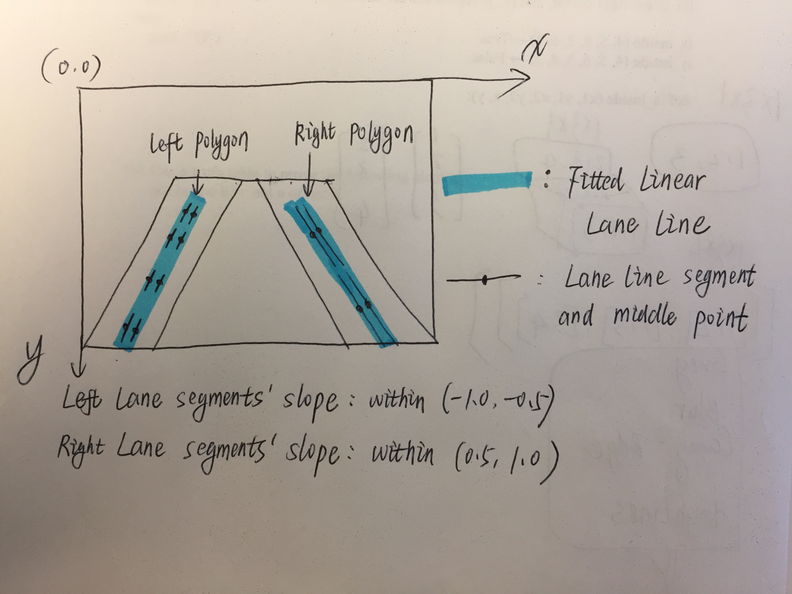
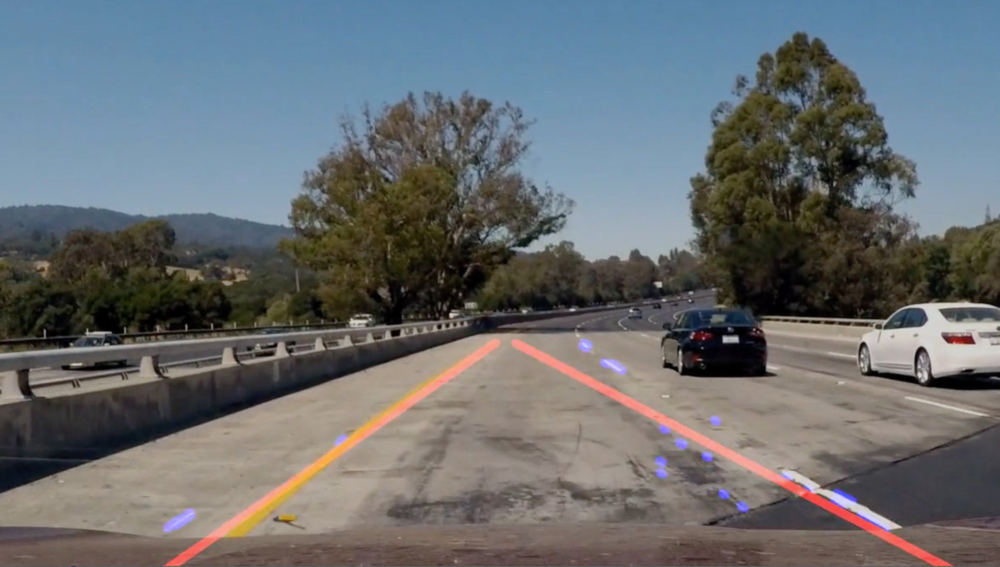

# **Finding Lane Lines on the Road** 

## Submitted by: Peng Su 5.27.2017

---

**Finding Lane Lines on the Road**

The goals / steps of this project are the following:
* Make a pipeline that finds lane lines on the road
* Reflect on your work in a written report

---

### Reflection

### 1. Describe your pipeline. As part of the description, explain how you modified the draw_lines() function.

My pipeline consisted of 6 steps. 1) I converted the images to grayscale. 2) I Gaussian-smoothed the gray image. 3) I detected the edges using Canny. 4) I selected edges only in the region-of-interest. 5) I detected lane lines using Hough Transformation. 6) I combined the lane lines with the original image as output. 

In order to draw a single line on the left and right lanes, I modified the draw_lines() function in the following steps and the figure below.

1) I defined a left and a right ploygon, so that only edges falling within these polygons are considered as lane line segments. I did this in order to eliminate a lot of the tree shadow edges (in the challenge video). 
2) Edges in the left polygon with slope in (-1.0, -0.5) are considered as part of left lane line. Edges in the right polygon with slope in (0.5, 1.0) are considered as part of right lane line.
3) The middle points of the left and right lane line segments are used to fit two linear-regression lines: one for the left lane and one for the right. These two fitted lines are drew into the image. 

4) In the challange video, I noticed a few issues. In the figure below, you can see that only three segments are detected for the left lane line, and a lot of false-positive segments for the right lane line due to tire marks. To address these issues, I proposed a moving-average approach, i.e. if lane line slope differs a lot (>0.1 and the threshold is adjustable) from the previous frame's slope, I used the average of the two (slope and intercept) as new line. Doing this is reasonable since the lane line slopes in the video should not change abruptly. Another thing I made is limiting the minimum number of segments to use to fit a linear-regression line. If less than 3 segments are detected for a lane line, I simply used the previous frame's lane line.

### 2. Identify potential shortcomings with your current pipeline

Scenarios below would cause pipeline failures. 
1) Camera postion and/or angle changed. In this case, the pipeline would fail since the region-of-interest is hard-coded.
2) Changing camera. A new camera might have different frame size and/or sensitivity. In this case, the edge detection thresholds and Hough transformation parameters would have to change. 
3) City traffic with curbs. This pipeline might consider the curb edges as lane line segments, and the fitted lane line might be within the curb and the real lane line.
4) Faded lane lines, changing lighting (shadows, darkness, etc.). The Canny low_threshold and high_threshold are fine-tuned for the videos provided in this project. These parameters would not work as well under different lighting conditions. 
5) Curvetures. This pipeline fitted a linear-line. Under big curvatures, higher-order lines might be needed.

As a summary, the current pipeline has parameters that need to be fine-tuned for different driving scenarios. It is impossible to exhaust every single scenario for calibrated parameters. Thus we should either do an automated parameter calibration, or develope a better approach for lane-line detections. 

### 3. Suggest possible improvements to your pipeline

A possible improvement would be using a clustering algorithm to better select lane-line segments. 
Fitting a second-order polynomial to represent the lane lines would work better for curvatures. But this will need more data points.
Another way of doing lane line detection is Convolution Neural Network, which will need images with annotated lane lines as training data. 
